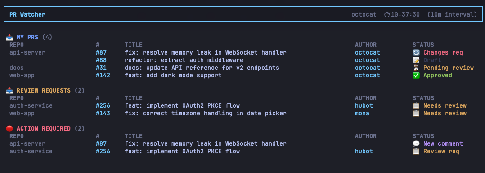

# pr-watcher

A CLI dashboard for real-time monitoring of GitHub PR status in your terminal.

Displays your created PRs, review requests, and items requiring action at a glance.



## Prerequisites

- [GitHub CLI (`gh`)](https://cli.github.com/) installed and authenticated

```sh
gh auth status  # Check authentication status
```

## Installation

```sh
# bun
bun add -g pr-watcher

# npm
npm install -g pr-watcher
```

Or run directly without installing:

```sh
# bun
bunx pr-watcher

# npm
npx pr-watcher
```

## Usage

```sh
pr-watcher
```

### Options

| Flag | Description | Default |
|---|---|---|
| `--interval`, `-i` | Auto-refresh interval (minutes) | `10` |

```sh
# Refresh every 5 minutes
pr-watcher --interval 5
pr-watcher -i 5
```

## Development

```sh
bun install
bun run dev
```

## Key Bindings

| Key | Action |
|---|---|
| `r` | Manually trigger an immediate refresh |
| `q` / `Ctrl+C` | Quit |

## Display

- **My PRs** — Your open PRs (with review status and comment count)
- **Review Requests** — PRs where your review is requested
- **Action Required** — PRs with unread notifications (new comments, review requests, etc.)
